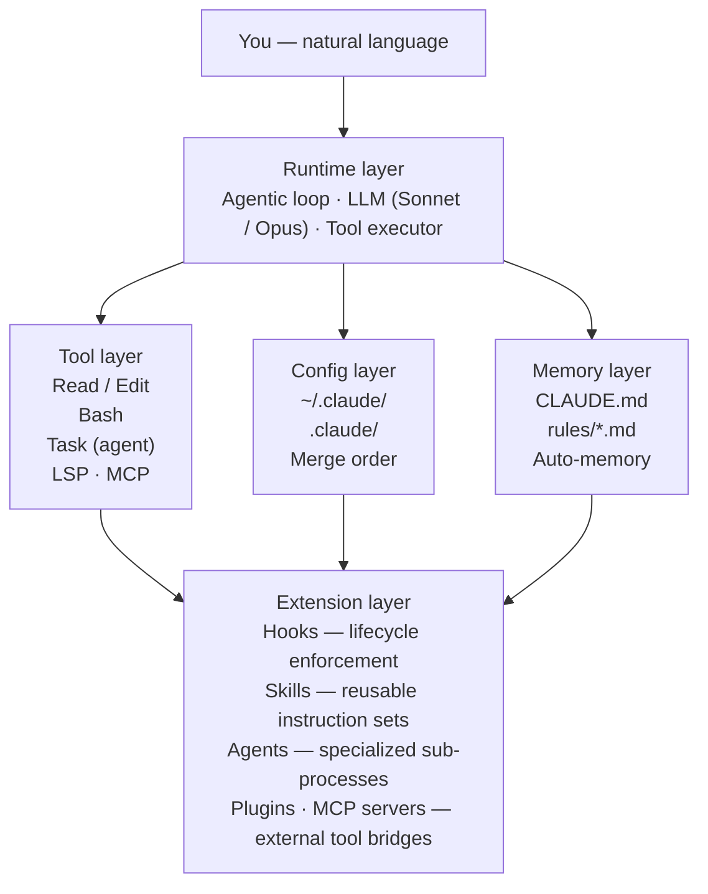
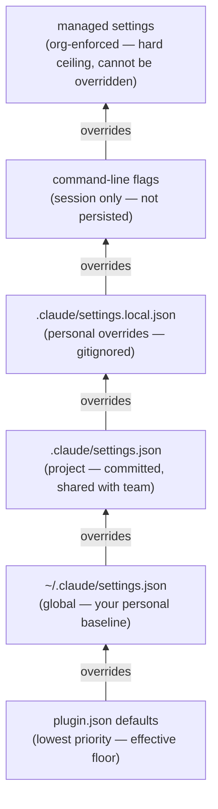

# L4 , Scoping: Project vs Global

**Where you are:** You have a working project configuration — CLAUDE.md, `settings.json`, and the `.claude/` directory. You've seen `~/.claude/` references and deferred them.  
**Goal:** Complete the project scope picture with the primitives not yet covered, then understand the global scope and how the two compose.

---

## The architecture , five layers

Before going into either scope, it helps to see where configuration sits inside the full system:



L5–L9 each go deep on one part of the Extension and Config layers. L4 is the map.

---

## Project scope , the full picture

Everything you did in L2 and L3 was project scope: CLAUDE.md, `settings.json`, `settings.local.json`. Those live in the project and apply only to it. But the project has more primitives than those.

```
your-project/
├── CLAUDE.md               # conventions, architecture, build commands
├── CLAUDE.local.md         # personal project overrides — gitignored, not shared
├── .mcp.json               # MCP server definitions for this project
│
└── .claude/
    ├── CLAUDE.md            # alternative location for project instructions
    ├── settings.json        # team permissions + hooks (committed to git)
    ├── settings.local.json  # personal overrides (gitignored)
    │
    ├── rules/               # ← not yet covered
    ├── commands/            # ← not yet covered
    ├── hooks/               # ← L5
    ├── skills/              # ← L7
    └── agents/              # ← L7
```

`hooks/`, `skills/`, and `agents/` are covered in their own levels. What remains is `rules/`, `commands/`, and two files worth calling out explicitly.

**`CLAUDE.local.md`** sits at the project root and loads alongside `CLAUDE.md` at session start. It is for personal project-specific preferences — your sandbox URLs, preferred test data, local paths — that should not be committed. Create it manually and add it to `.gitignore`. It never reaches the team; `CLAUDE.md` does.

**Project CLAUDE.md location.** The official supported locations are `./CLAUDE.md` at the project root or `./.claude/CLAUDE.md` inside the `.claude/` directory. Both are treated identically. Use whichever fits your repo layout.

### `.claude/rules/` , scoped CLAUDE.md fragments

CLAUDE.md is a single file loaded in full at session start. As a project grows, conventions split by domain: the frontend team cares about React and Tailwind; the backend team cares about Hexagonal architecture and SQL conventions. Putting all of that in one file costs context tokens on every session regardless of which part of the codebase is being worked on.

`rules/` fragments solve this. Each fragment is a markdown file with a `paths:` header. Claude loads the fragment only when it reads a file that matches one of those paths.

```markdown
---
# .claude/rules/frontend.md
paths:
  - "src/frontend/**"
  - "*.tsx"
---
# Frontend conventions
- React 19, functional components only
- Zustand for global state, no Redux
- Tailwind only , no inline styles or CSS modules
- Never fetch directly in components , use the api/ layer
```

```markdown
---
# .claude/rules/domain.md
paths:
  - "src/domain/**"
---
# Domain layer rules
- No imports from infra/ , use port interfaces in domain/port/
- Entities are pure Java, no framework annotations
- No repository.save() inside entity methods
```

The practical effect: working on a frontend file loads the frontend fragment; working on a domain class loads the domain fragment; neither loads both. Context cost is scoped to what is actually relevant.

> Rules are advisory, same as CLAUDE.md. For rules that must always hold, use a `PreToolUse` hook (L5).

### Another solution to CLAUDE.md explosion , CLAUDE.md per module

`.claude/rules/` is not the only way to split a growing CLAUDE.md. You can place a `CLAUDE.md` directly inside each module or package directory:

```
your-project/
├── CLAUDE.md                 # project-wide conventions
├── src/
│   ├── frontend/
│   │   └── CLAUDE.md         # frontend-only conventions
│   ├── domain/
│   │   └── CLAUDE.md         # domain layer conventions
│   └── infra/
│       └── CLAUDE.md         # infra adapter conventions
```

Loading behavior is identical to rules fragments: the root CLAUDE.md loads at session start; subdirectory CLAUDE.md files load lazily when Claude reads a file in that directory.

|                         | `.claude/rules/*.md`                                                    | Subdirectory `CLAUDE.md`                                         |
| ----------------------- | ----------------------------------------------------------------------- | ---------------------------------------------------------------- |
| **Location**            | Centralised in `.claude/rules/`                                         | Lives alongside the code it describes                            |
| **Path matching**       | Explicit `paths:` header — can span unrelated directories or file types | Implicit — matches the directory it sits in and everything below |
| **Cross-cutting rules** | One fragment can match `src/frontend/**` and `*.tsx` together           | Not possible across directory boundaries                         |
| **Team visibility**     | Only Claude reads it                                                    | Readable by the whole team as documentation                      |
| **Monorepo fit**        | Good when conventions cross package lines                               | Natural when each package is independently owned                 |

Use rules fragments for cross-cutting patterns. Use subdirectory CLAUDE.md when the conventions belong to a specific module and should travel with it. Both load independently and compose — you can use them together.

### `.claude/commands/` , project slash commands

Custom slash commands package a repeatable prompt into a named command. The filename becomes the command: `review.md` → `/review`.

```
.claude/commands/
├── review.md
├── commit.md
└── gate.md
```

A command file is a markdown file with optional frontmatter:

```markdown
---
description: Review staged changes before committing
allowed-tools: Read, Bash(git *)
argument-hint: [scope]
---

Review the staged changes in `git diff --cached`.

Check for:
- Logic errors and missing edge cases
- Debug code, TODOs, or console.log left in
- Anything that touches auth, payments, or data mutation

Scope: $ARGUMENTS

Output a bullet list of findings grouped by severity: blocker, warning, suggestion.
If there are no blockers, end with "Ready to commit."
```

Invoke it as `/review` or `/review payments module`.

The `allowed-tools` frontmatter restricts which tools this command can use. The `argument-hint` is shown in autocomplete. Both are optional.

Common patterns that earn their place as commands:

|Command|What it does|
|---|---|
|`/commit`|Checks staged diff for TODOs and debug code, then writes the commit message|
|`/review`|Reviews a diff for logic errors, security gaps, and coverage before a PR|
|`/gate`|Runs the full quality pipeline (lint, typecheck, tests) and stops on first failure|
|`/fix`|Takes an issue number or error message as `$ARGUMENTS` and implements the fix|
|`/explain`|Deep-explains a file or function: what it does, callers, edge cases|

The rule: if you are re-typing the same prompt structure more than three times, it belongs in a command.

> Project commands live in `.claude/commands/`. Personal commands that span all your projects live in `~/.claude/commands/` — covered in the global scope section below.

### `.mcp.json` , project MCP servers

MCP servers give Claude tools beyond the built-in set: GitHub API, your database, Playwright for browser automation. `.mcp.json` at the project root defines which servers are available in this project. It is committed to git so the team shares the same server configuration.

This is covered in full in L6. For now: the file exists at the project root, not inside `.claude/`.

---

## Global scope , the same ideas, wider reach

Everything in project scope has a direct global equivalent. The mental model: **project scope is for this codebase; global scope is for you across every codebase.**

### What the two scopes share

|Primitive|Project scope|Global scope|
|---|---|---|
|Memory|`CLAUDE.md` (root or `.claude/`)|`~/.claude/CLAUDE.md`|
|Private memory|`CLAUDE.local.md` (gitignored)|edit `~/.claude/CLAUDE.md` directly — it is never committed|
|Scoped memory|`.claude/rules/*.md`|no equivalent — rules are path-matched per project|
|Permissions|`.claude/settings.json`|`~/.claude/settings.json`|
|Personal overrides|`.claude/settings.local.json`|no equivalent — `~/.claude/settings.json` is already personal|
|Slash commands|`.claude/commands/`|`~/.claude/commands/`|
|MCP servers|`.mcp.json` at project root|`~/.claude.json` (user-scope server config)|

### What the project scope has that global does not

`.claude/rules/` has no global equivalent. Rules are path-matched, which only makes sense relative to a specific project's directory structure. A global `rules/` fragment would have no meaningful paths to match against across all projects.

`CLAUDE.local.md` has no global equivalent either. At the global level, `~/.claude/CLAUDE.md` is already personal — it is never committed anywhere — so a separate "local" variant would be redundant.

Hooks, skills, and agents can live in `.claude/` (project) or `~/.claude/` (global), but project scope is almost always the right choice — they encode project-specific behavior.

### What the global scope has that project does not

`~/.claude/projects/` is auto-memory: Claude writes and reads per-project memory across sessions, managed automatically. You do not edit this directory.

`~/.claude/sessions/` stores session history. Used by `claude -r` to browse and restore past sessions.

`~/.claude/plugins/` stores installed plugins. Plugins are global: installing a plugin makes it available in every project. Covered in L6.

`~/.claude/output-styles/` stores named response format definitions. Each file is a markdown document that becomes a named style you activate via `/config`. The style is injected as a system-prompt section that shapes how Claude formats every response in that session.

Two examples that cover opposite ends of the spectrum:

```markdown
---
# ~/.claude/output-styles/engineering.md
name: engineering
description: Dense, technical, no filler. For coding sessions.
---
- No preamble. Start with the answer or the code.
- Code before explanation.
- Use tables for comparisons, not prose.
- If showing multiple options, rank them — don't just list.
- Never use filler phrases: "Great question", "Certainly", "Of course".
- Omit explanation of things not asked about.
```

```markdown
---
# ~/.claude/output-styles/review.md
name: review
description: Structured findings for code and document review tasks.
---
- Always open with a one-line verdict: ready / needs work / blocked.
- Group findings by severity: blocker → warning → suggestion.
- Each finding: file, line, problem, suggested fix.
- End with a summary of the main theme across all findings.
- No praise for things that are simply correct.
```

Activate with `/config` → Output Style → the style name. You can define as many as you want and switch between them mid-session.

### `~/.claude/` anatomy

```
~/.claude/
├── settings.json       # global model, effort, universal allow/ask/deny, defaultMode
├── CLAUDE.md           # conventions true for ALL your projects , keep under 50 lines
├── commands/           # personal slash commands available in every project
├── projects/           # auto-memory per project (managed by Claude, do not edit)
├── sessions/           # session history (claude -r)
├── plugins/            # installed plugins
├── output-styles/      # named response format definitions
└── .claude.json        # OAuth tokens, MCP user-scope config, per-project state (auto-managed)
```

**`~/.claude/CLAUDE.md`** — the same format as project CLAUDE.md, loaded in every session regardless of project. Keep it to conventions that are genuinely universal across all your work: shell preferences, git commit style, general code rules. Anything project-specific that ends up here wastes context tokens in sessions where it is irrelevant.

**`~/.claude/commands/`** — same format as `.claude/commands/`. A command here is available in every project without copying it. Use for workflows that span projects: a `/audit` command that checks for hardcoded secrets, a `/standup` command that summarises recent git commits, a `/cleanup` command that removes debug artifacts.

**`~/.claude/settings.json`** — same schema as project `settings.json`. Sets the baseline for every session. Project settings layer on top; project settings win on scalar conflicts.

```json
{
  "model": "claude-sonnet-4-6",
  "effortLevel": "high",
  "showTurnDuration": true,
  "cleanupPeriodDays": 30,
  "permissions": {
    "defaultMode": "acceptEdits",
    "allow": [
      "Bash(git *)",
      "Bash(npm run *)",
      "Bash(make *)",
      "Read(~/.zshrc)"
    ],
    "ask": [
      "Bash(git push *)"
    ],
    "deny": [
      "Bash(rm -rf /*)",
      "Bash(sudo rm *)",
      "Bash(curl *)",
      "Bash(wget *)"
    ]
  }
}
```

`curl` and `wget` are denied globally because Bash URL patterns are trivially bypassed — they belong here rather than repeated in every project config. Use `WebFetch(domain:...)` rules in project `settings.json` for the specific domains each project needs to reach.

### Shell aliases

Add short aliases to `~/.zshrc`. The pattern is `cc` for interactive, `cch` for headless, `ccr` for resume, with model variants as needed. Each alias needs a distinct name — a duplicate silently overwrites the earlier one.

```bash
alias cc="claude --dangerously-skip-permissions"
alias cco="claude --dangerously-skip-permissions --model claude-opus-4-7"
alias ccr="claude -c --dangerously-skip-permissions"
alias cch="claude -p --dangerously-skip-permissions"
alias ccmax="claude --dangerously-skip-permissions --model claude-opus-4-7 --effort max"
alias cci="claude -p --dangerously-skip-permissions --model claude-sonnet-4-6 --effort low --bare"
```

Run `source ~/.zshrc` to apply.

---

## Permission hierarchy , how the scopes compose

Rules from all scopes are active simultaneously. The merge works differently depending on whether the setting is an array or a scalar.



**Arrays** (`allow`, `ask`, `deny`) are concatenated and deduplicated across all scopes. A rule in the global deny list is denied in every project. A rule in the project allow list adds to, not replaces, the global allow list. Both sets are active.

**Scalars** (`model`, `defaultMode`, `effortLevel`) resolve to the value set by the highest-priority scope that defines them. If global sets `defaultMode: acceptEdits` and the project also sets it, the project value wins. If the project does not set it, the global value applies.

**Managed settings** are the hard ceiling. They cannot be overridden by any user, project, or local configuration. Enterprise environments may deliver them via `managed-settings.json` or a `managed-settings.d/` drop-in directory.

The practical consequence: put your universal deny rules globally once. Put project-specific allows and asks in the project. The result in any given session is the union of both.

---

## Map of L5–L9

L4 introduced the scoping architecture. The next five levels are deep dives into each primitive:

|Level|Primitive|What it does|
|---|---|---|
|[[L5-Hooks]]|Hooks|Deterministic lifecycle enforcement — shell scripts that fire on events (`PreToolUse`, `PostToolUse`, `SessionStart`)|
|[[L6-MCP-Servers-and-Plugins]]|MCP + Plugins + LSP|Connects Claude to external services; extends it with plugin-installed capabilities and semantic code navigation|
|[[L7-Skills-Agents-Commands]]|Skills, Agents, Commands|Packages reusable workflows; delegates subtasks to isolated sub-agents|
|[[L8-MultiAgent-Headless-Power]]|Multi-Agent & Headless|Parallel execution via git worktrees, CI integration, scheduling, power prompting patterns|
|[[L9-Context-Cost]]|Context Cost|Token budget implications of every harness component you've configured|

Each primitive can be configured at project scope, global scope, or both. L9 covers the cost tradeoffs of where you place each one.

---

## Tips

- [ ] Set `defaultMode: acceptEdits` in `~/.claude/settings.json` once , every project inherits it without repeating it
- [ ] Keep `~/.claude/CLAUDE.md` under 50 lines , it loads in every session including projects where it is irrelevant
- [ ] Put universal blockers (`curl`, `wget`, `sudo rm`) in the global deny list; put project-specific restrictions in the project deny list
- [ ] `/init` in every new project, then trim the output immediately; add `CLAUDE.local.md` to `.gitignore` for personal notes
- [ ] Commit `CLAUDE.md`, `.claude/settings.json`, and `.mcp.json` , teammates get the same environment automatically
- [ ] `settings.local.json` and `CLAUDE.local.md` → always in `.gitignore`
- [ ] Rules fragments in `.claude/rules/` load lazily — they cost nothing in sessions where Claude doesn't touch their paths
- [ ] Each alias in `~/.zshrc` needs a distinct name , a duplicate silently overwrites the earlier definition

---

## What's next

L4 maps the whole system. L5 goes deep on **hooks** , the deterministic enforcement layer that makes CLAUDE.md rules mechanical rather than advisory.